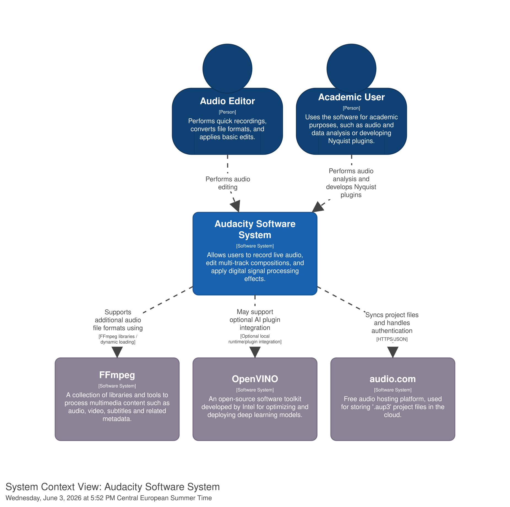
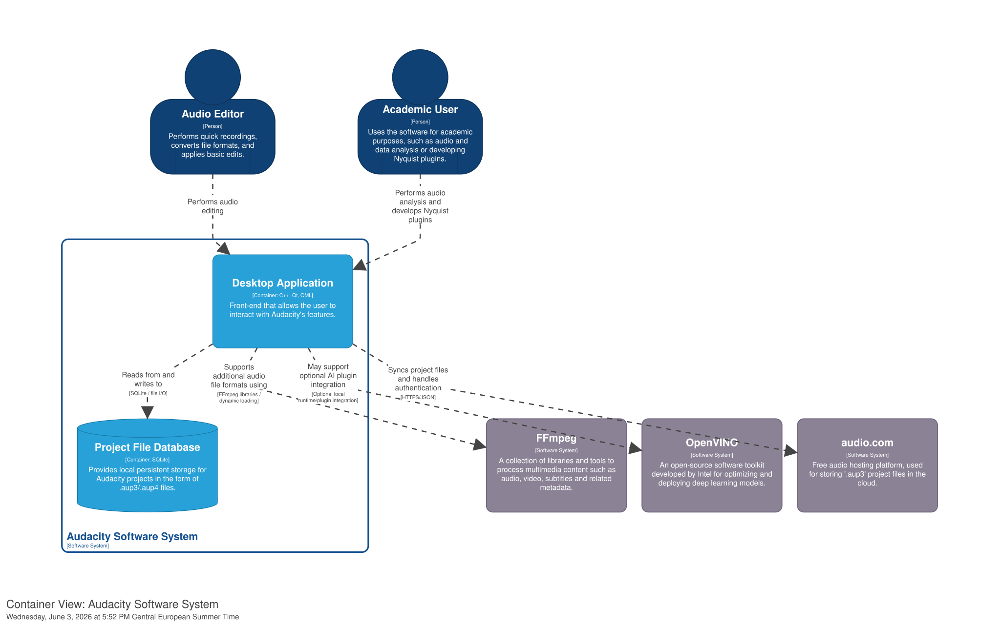
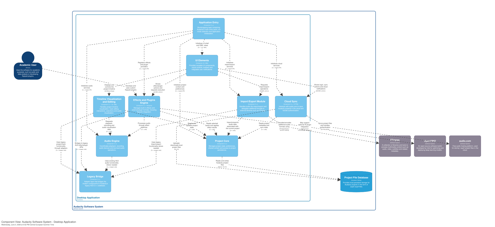

## Introduction

### Audacity's massive technical debt

For two decades, new features were built as expansions on top of existing code without a cohesive master plan. This led to an architecture where parts of the codebase that should have been separate became utterly entangled, leading to an almost unmaintainable project. This was aggravated by the decentralized, volunteer-based nature of the project, where various contributors added to the code over time without strict architectural oversight.

Another major problem lies in WX Widgets, the framework that was previously used to render the software's UI: not only it made implementing simple UI designs a nightmare, often requiring compromises on basic features like animations, transparency, and shadows, but it also caused inconsistencies across operating systems, where code that worked on macOS might not compile on Windows or look the same on Linux.

Because of this debt, it became virtually impossible to estimate task duration, with one-month projects frequently ballooning into four or five months of work.

### The Solution

The main objective of Muse Group, the company who acquired Audacity, is to solve most of these issues by by re-platforming to the Qt framework, in order to get rid of the old UI based on WX Widgets, while also refactoring the code into a more modular architecture that takes advantage of other components defined in the muse framework.

## Tooling Declaration

The C4 diagrams were produced using [Structurizr](https://structurizr.com/).

The  defines the model, the relationships between elements and the different views used in the report: System Context, Container and Component diagrams.

The diagrams can be explored interactively either by [installing Structurizr locally](https://docs.structurizr.com/local/quickstart) or by pasting the DSL code into the [online playground](https://playground.structurizr.com/). The document also includes static, pre-rendered versions of the diagrams.

## Context Level

### Diagram



### Actors

According to [this video](https://youtu.be/QYM3TWf_G38?si=HPh6X9NU7opD_eNJ) from Tantacrul, a developer currently in charge of the application's UX/UI design, Audacity user base is split in the following macrocategories: simple audio editors, musicians, audio producers and academic users. In the system's context diagram, We've decided to simplify things a bit, dividing the user base into two main classes: _regular users_, who limit their usage to Audacity's core functionalities, and _academic users_, who may need to make use of some of Audacity's more advanced features, such as the ability to write Nyquist plugins.

### Software Systems

Although being quite complete by itself, Audacity relies on some external programs and services to provide some of its core functionalities.

#### FFmpeg

To allow the user to seamlessly import/export additional file formats, such as M4A and WMA, Audacity interacts with [FFmpeg](https://github.com/FFmpeg/FFmpeg), an open-source suite of libraries and programs for handling multimedia files. Due to patent restrictions, FFmpeg cannot be distributed with Audacity itself and needs to be installed separately by the user.

#### Cloud integration via audio.com

The ability to save project files in the cloud has been a feature since Audacity 3.5, released on 22/04/2024.

It is centered around [audio.com](https://audio.com/), a free audio hosting platform. It provides _background syncing_ (every time the project is saved locally, Audacity automatically syncs the latest changes in background, ensuring the online version remains up to date) and _version control and recovery_, allowing the user to revert the project to an earlier version. To take advantage of these feature, the user needs to register an account on `audio.com`.

Projects stored in the cloud can be directly opened from Audacity.

#### OpenVINO Plugins

On top of an already existing plugin ecosystem based on `libnyquist`, since version 3.7.4 Audacity has started implementing a set of AI-based plugins via [OpenVINO](https://github.com/openvinotoolkit/openvino). This expansion allows the system to delegate complex tasks, such as noise suppression, music separation, and automated transcription, to an external inference engine. All these models run locally on the user's hardware, ensuring privacy and eliminating the need for an internet connection.

To implement the automated transcription features, Audacity relies on [Whisper.cpp](https://github.com/ggml-org/whisper.cpp), a high-performance C++ port of OpenAI's [Whisper](https://github.com/openai/whisper) model.

## Container Level



### The main containers

By taking a look at the project structure in the `src/` directory, it is pretty clear that Audacity is implemented as a **modular monolith**, where the application is deployed as a single desktop application and is internally divided into logical modules, each contributing a separate responsibility.

The core of the main desktop application is developed in C++, while the user interface layer is built using Qt and QML. This is where the main application modules are contained, such as the audio editing logic, the plugin/effect system, the cloud integration module and so on.

As shown in the diagram, the main desktop application interacts with the file system to store projects using Audacity's proprietary `.aup3` and `.aup4` formats, both of which are built on top of SQLite.

### What about other containers?

While Audacity also relies on other software programs, such as `libnyquist`, for giving the users a way to write custom plugins, and the `muse_framework`, which plays a central role in Audacity's new refactored architecture, we haven't decided to consider them as separate containers. As Simon Brown also says,

> "frameworks are usually something that you build your software on top of, while libraries are things that your software uses. In most cases, these are really just technology choices that components make use of, and are therefore implementation details rather than components in their own right."

Indeed, this is what we're seeing here. `libnyquist`, for example, is neatly integrated inside the `effects` module to give the users a way to extend the application to their likings.

### Relationship with the Clean Architecture blueprint

Audacity should not be described as a strict or textbook implementation of Clean Architecture. It is a large historical desktop application, and part of its current structure still depends on legacy AU3 code and on technical constraints accumulated over time.

However, the newer modular organization can be interpreted through some Clean Architecture principles. At container level, Audacity is best understood as a **modular monolith**: it is deployed as a single desktop application, but internally it separates user interaction, application coordination, domain-specific modules, adapters and infrastructure-related concerns.

A simplified reading is the following:

```text
UI / Presentation
    -> application actions and controllers
        -> domain-specific modules
            -> adapters, infrastructure, external systems and legacy code
```

In this interpretation, the **Audacity Desktop Application** contains the presentation and application-facing parts of the system. The user interacts with menus, toolbars, dialogs and the project scene, but these UI elements should mainly collect input and delegate operations rather than directly implementing all the audio-processing or persistence logic.

The **Audio Engine**, **Project Core** and **Effects and Plugins Engine** are closer to the application/domain side. They represent the parts of the system that coordinate playback, recording, project state, editing operations and the execution of effects. These are central to Audacity's behavior and should remain more stable than the external technologies used to support them.

External systems and technical dependencies belong to the outer layers. For example, the **Project File Database** is based on SQLite-backed `.aup3`/`.aup4` project files, **FFmpeg** supports import/export of additional audio formats, **audio.com** supports cloud-related features, and **OpenVINO** or **Whisper.cpp** can provide optional AI-related functionality. From a Clean Architecture perspective, these technologies should be treated as implementation details and accessed through dedicated modules or adapters.

The **Legacy Bridge** is particularly important in this reading. The `au3wrap` layer shows that Audacity is not replacing the old AU3 core all at once; instead, it encapsulates legacy functionality behind a boundary that can be used by the newer modular code. This is close to the role of an interface adapter: it allows the newer parts of the application to communicate with legacy code without exposing every internal detail of the old implementation.

Therefore, the main Clean Architecture relationship visible in the container diagram is not a perfect circular layered model, but the intended **direction of dependency and responsibility**:

```text
User interface
  -> application coordination
    -> core audio/project/effect modules
      -> infrastructure, plugin runtimes, file formats, cloud services and legacy code
```

This also affects how the container relationships should be read. For example, the Desktop Application does not mean that every UI class directly accesses SQLite, FFmpeg or plugin runtimes. Rather, the deployable desktop application uses those technologies through internal components such as Project Core, Import/Export, Effects and Plugins, Cloud Sync and the Legacy Bridge.

For this reason, Audacity can be described as a system that **does not implement Clean Architecture completely**, but whose ongoing modular refactoring follows similar goals: separating presentation from core behavior, isolating external dependencies, and wrapping legacy code behind clearer architectural boundaries.

## Component Level



At component level, the Desktop Application is decomposed into the main internal modules that collaborate to provide Audacity's functionality.

In theory, each module inside the `src/` directory could be considered as an isolated component, however we have decided to group some of them together based on the functionality they contribute to the application (e.g. `uicomponents` and `toast` were both grouped inside the `UI Elements` component, as they both contribute to the overall UI).

- **Application Entry**, which contains the startup logic, run mode selection and application initialization.
- **UI Elements**, which groups reusable UI widgets, panels, toolbars and integrated notifications.
- **Timeline Visualization and Editing**, which manages the main project timeline, track visualization, selections and editing interactions.
- **Project Core**, which manages project state, preferences, shared context and access to project persistence.
- **Audio Engine**, which coordinates playback, recording, audio devices and low-level audio operations.
- **Effects and Plugins Engine**, which manages built-in effects and external plugin formats, including Nyquist integration.
- **Import/Export Module**, which handles audio file import/export and delegates additional formats to FFmpeg.
- **Cloud Sync**, which communicates with audio.com for cloud project synchronization and authentication.
- **Legacy Bridge**, which wraps legacy AU3 functionality and makes it usable from the newer modular code.

The Application Entry component includes a `main.cpp` file, which represents the entry point of the application. Here, a new `AppFactory` object is created and a `setup` method is called, which is responsible for importing all the modules inside the application, as shown below:

```cpp
std::shared_ptr<muse::IApplication> AppFactory::newGuiApp(const std::shared_ptr<AudacityCmdOptions>& options) const {
    // Muse modules
    app->addModule(new muse::diagnostics::DiagnosticsModule());
    app->addModule(new muse::audioplugins::AudioPluginsModule());
    app->addModule(new muse::actions::ActionsModule());

    // ...

    // Audacity modules
    app->addModule(new au::appshell::AppShellModule());
    app->addModule(new au::preferences::PreferencesModule());
    app->addModule(new au::uicomponents::UiComponentsModule());
    app->addModule(new au::effects::AudioUnitEffectsModule());

    // ...

    return app;
}
```

### SOLID Principles

#### Single Responsibility Principle (SRP)

The SRP can be seen being used around the whole application. At the component level, by inspecting the `src/` directory it is clear that each component only contributes towards a specific feature (e.g. the `au3cloud/` module only handles user authentication and project cloud sync, while `effects/` takes care of the effects and plugins support).

```txt
./src/
├── app
├── au3audio
├── au3cloud
├── ...
├── effects
└── uicomponents
```

If we zoom one level further, we can see that this principle is also applied at the code level: in the `au3cloud/internal` directory, for example, we can see that almost each class/interface pair is responsible for only one subtask inside the "cloud" domain (e.g. `cloudurlhandler.cpp/h` handles cloud-application interactions, such as opening a project stored in the cloud directly into Audacity given a specific URI, and `au3cloudservice.cpp/h` handles user authentication with `audio.com`, including sign-in and sign-out operations).

#### Open-Closed Principle (OCP)

The use of the OCP is particularly evident in the `effects` component, especially in the way Audacity handles different effect technologies.

At high-level, the application provides an effect loader in `effects_base/ieffectloader.h`, which defines what the system needs to know about a plugin family. Then the `EffectsProvider` (defined in `effects_base/internal/effectsprovider.cpp`) can load a new family of effects by simply asking for the correct loader and calling it polymorphically, as show in the following snippet. This represents the "closed" part of the principle, as these two classes never need to change, even when new technologies are added.

```cpp
bool EffectsProvider::loadEffect(const EffectId& effectId) const
{
    const IEffectLoaderPtr loader = this->loader(effectId);
    if (!loader) { return false; }
    return loader->ensurePluginIsLoaded(effectId);
}
```

The "open" part can be seen in the ways the actual effect technologies are implemented: each plugin family simply needs to define a custom `EffectLoader`, which is then registered into `IEffectLoadersRegister` (below is an example for `libnyquist`).

```cpp
m_effectLoader = std::make_shared<NyquistEffectsLoader>();
auto loadersRegister = globalIoc()->resolve<IEffectLoadersRegister>(moduleName());
if (loadersRegister) {
    loadersRegister->registerLoader(m_effectLoader);
}
```

#### Liskov Substitution Principle (LSP)

The LSP is applied once again in the `effects` module, particularly in the implementation of loaders for the various effect technologies.

Thanks to the fact that each concrete loader fully implements the `EffectLoader` interface, the `EffectsProvider` can work under the assumption that those loaders are behaviorally interchangeable, and is thus free to call the methods implemented by the interface without having to worry about adding special-case logic for any specific family.

#### Interface Segregation Principle (ISP)

The `trackedit` component inside the `src/` directory shows both a violation and an in-progress solution of the ISP.

`src/trackedit/itrackeditinteraction.h` is a ~150 line long, "fat" interface that takes charge of at least four unrelated responsibilities:

| Responsibility    | Methods                                           |
| ----------------- | ------------------------------------------------- |
| Clip manipulation | `changeClipStartTime`, `trimClipsLeft`, ...       |
| Track management  | `newMonoTrack`, `deleteTracks`, `moveTracks`, ... |
| Undo/redo history | `undo`, `redo`, ...                               |
| Clipboard         | `pasteFromClipboard`, `clearClipboard`, ...       |

A comment in the same file denotes that the developers are already aware of this issue

```cpp
//! NOTE Interface for interacting with the project
//! When it gets big, maybe we’ll divide it into several
```

Indeed, this interface is currently being split into multiple segregated replacements, such as `iclipsinteraction.h`, `itracksinteraction.h` and so on.

#### Dependency Inversion Principle (DIP)

The codebase heavily utilizes the DIP throughout the `src/` directory. Taking the `au3audiocomservice.cpp` class inside the `au3cloud` component as an example (although it should be noted that many other choices were possible), we can see that interactions with the filesystem do not depend directly on low-level utilities modules, such as the operating system's filesystem APIs, but rather use a `filesystem` object, which is an instance of the higher-level `IFileSystem` interface, as see in the following line taken from the related header file.

```cpp
muse::GlobalInject<muse::io::IFileSystem> filesystem;
```

## Architectural Characteristics

To summarize, the architecture of Audacity is designed to balance the needs of two primary stakeholders: the end-users and the open-source developers. The major refactoring that's currently being carried out is aimed at improving the overall experience for both parties.

### User-Oriented Characteristics

From a user standpoint, Audacity should appear as a fast, reliable and extensible audio editor, that does not sacrifice on its looks.

The architecture maintains its _performance_ by keeping the core audio engines in highly optimized, native C++ components. Cloud support via `audio.clom` has been added to provide a higher degree of _reliability_, by allowing users to save their projects online, as well as locally on their personal machine. The ability to write `nyquist` plugins allows more experienced users to _extend_ the application to their liking and, finally, the UX/UI experience has been greatly improved thanks to the Qt re-platform.

### Developer-Oriented Characteristics

One of the main objectives of the new architecture is to simplify the development experience. The modular structure improves _maintainability_ because changes can remain localized to a specific component, and _extendability_, since modules can be developed independently and later loaded independently at startup. This aspect has also been greatly improved by the adoption of the `muse_framework`, which provides abstractions that can be used to further decouple components.

_Portability_ has also been greatly improved, thanks to the re-platform to Qt: now developers can rest assured that a UI component will look and work the same on every operating system.
