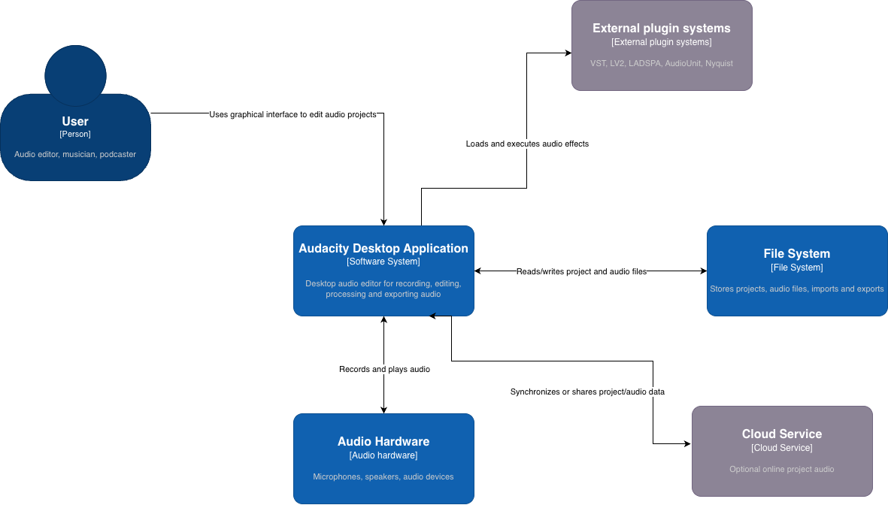
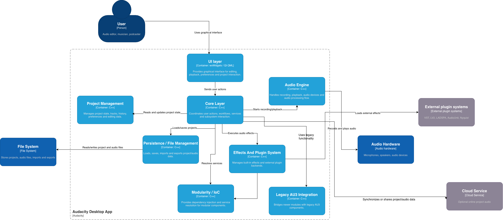

# Software Architecture

The architectural analysis focuses mainly on the current modular code under `src/`, while considering selected legacy 
components under `au3/` where they are still relevant to core behavior.

## 1. Tooling

The C4 diagrams were created using diagrams.net (draw.io).  
The diagrams follow the C4 model at three levels:

- Context level
- Container level
- Component level

The architecture was derived from the repository structure, include dependency analysis, co-change analysis, and identified
design patterns.

## 2. Context Level

At the context level, Audacity is represented as a desktop application used for audio recording, editing, processing, and exporting.

The primary actor is the user, such as an audio editor, musician, podcaster, or general user. Audacity interacts with the 
local file system for loading and saving projects and audio files, with audio hardware for recording and playback, with 
external plugin systems for audio effects, and with optional cloud services for online project/audio features.

This level abstracts away the internal structure of Audacity and focuses only on the relationship between the system, 
its users, and external dependencies.

## 3. Container Level

At the container level, Audacity is decomposed into its main architectural areas.

The UI Layer provides the graphical interface and contains both wxWidgets-based and Qt/QML-based elements. The Core Layer
coordinates user actions and connects the interface with project management, audio processing, effects, persistence, 
modularity infrastructure, and legacy functionality.

Project Management represents the central domain area responsible for project state, tracks, history, preferences, and 
editing data. The Audio Engine handles recording, playback, and audio device interaction. The Effects and Plugin System 
manages built-in effects and external plugin technologies such as VST, LV2, LADSPA, AudioUnit, and Nyquist.

In this diagram, containers represent major logical areas of the Audacity desktop application. They are not separate 
microservices or deployment units.

## 4. Component Level
## 5. Relationship with Clean Architecture
## 6. SOLID Analysis
## 7. Architectural Characteristics
## 8. Summary